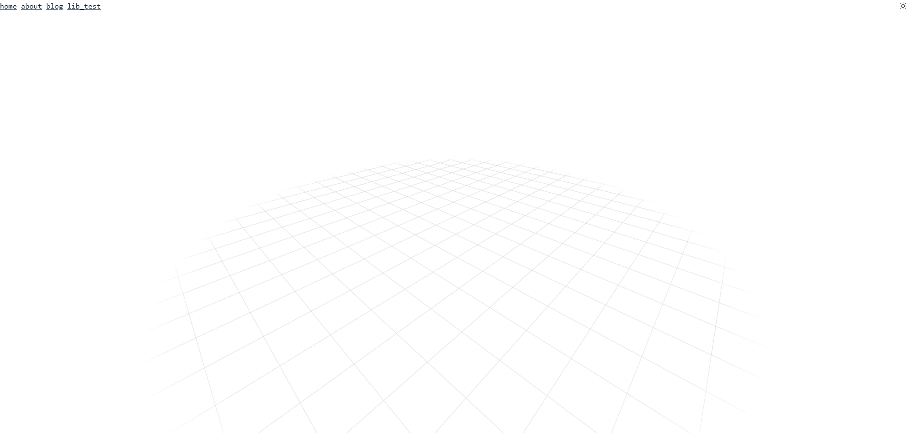

<h1 align="center">
    Immersion
</h1>

<p align="center">
    web graphics experimentation project. 
</p>

<p align="center">
    
    
    
    
    
    
</p>

<p align="center">
    
    <br>
    <sub><i> v0.18.3 Fading grid test</i></sub>
</p>


## Installation and Run

### Prerequisites
- **Node.js**: Version 16 or higher
- **Yarn**: Yarn package manager (Optional, but recommended for better performance)

### Installation Steps
1. Clone the repository:
    ```bash
    git clone https://github.com/kutaycoskuner/immersion.git
    ```

2. Navigate to the project directory:
    ```bash
    cd immersion/immersion
    ```

3. Install dependencies using Yarn:
    ```bash
    yarn install
    ```

### Running the Project

1. Start the development server:
    ```bash
    yarn dev
    ```

2. Visit the application:
    - Open your browser and go to `http://localhost:5000` to see the app in action.

### Build for Production

1. To create a production-ready build, run the following command:
    ```bash
    yarn build
    ```

2. Once the build process completes, you can preview the production build:
    ```bash
    yarn preview
    ```


